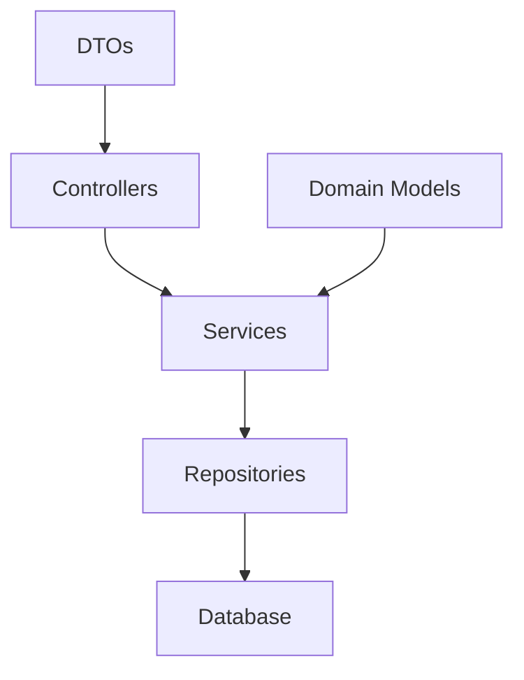

# System Patterns

## Architecture Overview
The project follows Clean Architecture principles with clear separation of concerns:



## Layer Responsibilities
1. **Controllers**
   - Handle HTTP requests
   - Input validation
   - Response formatting

2. **Services**
   - Business logic
   - Domain rules
   - Orchestration

3. **Repositories**
   - Data access
   - CRUD operations
   - Database interactions

## Design Patterns
1. **Repository Pattern**
   - Abstracts data access
   - Centralizes data operations

2. **Dependency Injection**
   - Uses fx for DI
   - Promotes loose coupling
   - Facilitates testing

3. **DTO Pattern**
   - Separates API contracts
   - Validates input/output

## Standard Practices
1. **Error Handling**
   - Domain-specific errors
   - Consistent error responses
   - Proper error logging

2. **Validation**
   - Input validation
   - Business rule validation
   - Data integrity checks

3. **Testing**
   - Unit tests
   - Integration tests
   - API tests with Bruno

## File Structure
```
domain/<feature>/
├── controller.go   # HTTP handlers
├── dto.go         # Request/Response objects
├── errorz.go      # Domain-specific errors
├── module.go      # Dependency injection
├── repository.go  # Database operations
├── route.go       # API routes
└── service.go     # Business logic
```
